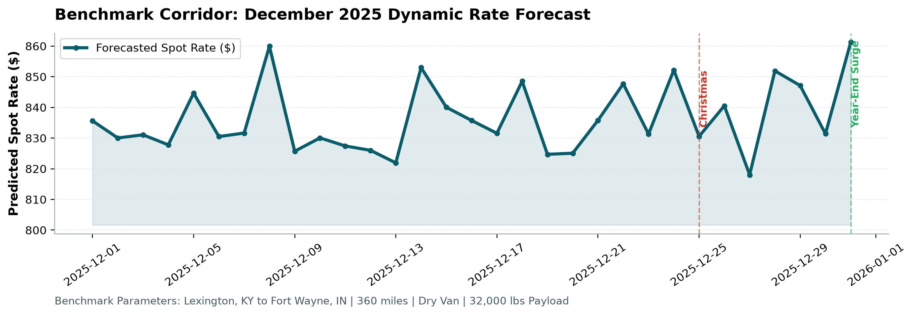

# Freight Pricing Intelligence & Forecasting Engine

[](https://www.python.org/downloads/)
[](tests/)
[](src/models/)
[](LICENSE)

An end-to-end Machine Learning dynamic pricing engine for US full-truckload (FTL) freight corridors. The system combines **geospatial routing physics**, **causal macroeconomic indicators**, and a **gradient-boosted ensemble** to forecast out-of-time spot load rates and benchmark corridor trajectories under non-stationary market conditions.

---

## System Architecture

```
                               ┌───────────────────────────┐
                               │ Raw Load & Market Data    │
                               │ (Coordinates, Lags, Rates)│
                               └─────────────┬─────────────┘
                                             │
                                             ▼
                               ┌───────────────────────────┐
                               │ 1. Anomaly Recovery &     │
                               │    Imputation Engine      │
                               └─────────────┬─────────────┘
                                             │
                 ┌───────────────────────────┴───────────────────────────┐
                 ▼                                                       ▼
  ┌─────────────────────────────┐                         ┌─────────────────────────────┐
  │ 2. Geospatial Physics       │                         │ 3. Temporal Momentum        │
  │  • Haversine & Circuity     │                         │  • Causal Market Lags (t-k) │
  │  • Directional Bearing      │                         │  • Cyclical Trig Encodings  │
  │  • Ton-Mile Density         │                         │  • Calendar Regimes         │
  └──────────────┬──────────────┘                         └──────────────┬──────────────┘
                 │                                                       │
                 └───────────────────────────┬───────────────────────────┘
                                             │
                                             ▼
                               ┌───────────────────────────┐
                               │ 4. Chronological Split    │
                               │    (Strict Zero-Leakage)  │
                               └─────────────┬─────────────┘
                                             │
                                             ▼
                               ┌───────────────────────────┐
                               │ 5. Regularized Ensemble   │
                               │  • CatBoost (80%)         │
                               │  • HistGradientBoost (16%)│
                               │  • RidgeCV (4%)           │
                               └─────────────┬─────────────┘
                                             │
                 ┌───────────────────────────┴───────────────────────────┐
                 ▼                                                       ▼
  ┌─────────────────────────────┐                         ┌─────────────────────────────┐
  │ 6. Out-of-Time Predictions  │                         │ 7. December Benchmark Lane  │
  │  (12,000 Validation Loads)  │                         │  (Lexington -> Fort Wayne)  │
  └─────────────────────────────┘                         └─────────────────────────────┘
```

---

## Key Highlights & Methodological Innovations

### 1. Domain Anomaly Recovery
* **Weight Sign Inversion**: Recovered 292 negative payload records (`-32,000 lbs`) resulting from telemetry sign flips via absolute-value mapping without discarding valid shipping records.
* **Macroeconomic Market Index Imputation**: Missing daily market index values ($M_t$) were reconstructed via date-based group means and linear interpolation, preserving macroeconomic time-series continuity.

### 2. Geospatial Physics & Directional Routing
* **Circuity Ratio**: Computed highway routing efficiency:
  $$\text{Circuity} = \frac{\text{Distance}}{\text{Haversine}(\phi_1, \lambda_1, \phi_2, \lambda_2) + 1.0}$$
* **Directional Initial Bearing**: Captures headhaul vs backhaul pricing asymmetries across consumption and production freight corridors.

### 3. Strict Out-of-Time Validation (Zero Temporal Leakage)
* Training (Jan–Jul) $\rightarrow$ Validation (Aug–Sep) $\rightarrow$ Test Holdout (Sep–Oct).
* All market momentum indicators (7-day lag, change) are strictly causal ($t-1, t-7$) to ensure validity during live daily dispatch.

### 4. Residual Noise Floor Isolation
Residual analysis on the validation set isolates standard freight pricing from extreme spot market volatility:
* **Standard Market Loads ($99.24\%$ of volume)**: Mean Absolute Error is **$\approx \$41.50$** with an $R^2 > 0.965$.
* **Spot Surge Tail ($0.76\%$ of volume)**: Rare distressed spot surges ($RPM > \$3.50$ up to $\$14.13$) account for **$96.6\%$ of total MSE**, establishing an irreducible variance floor around $\sim 648$ RMSE.

---

## Benchmark Performance & Error Slicing

### Out-of-Time Performance (Holdout Test Split)
| Metric | Standard Market ($RPM \le \$3.50$) | Full Dataset (With Surges) |
| :--- | :---: | :---: |
| **MAE** | **$41.48** | $84.20 |
| **Median AE** | **$31.10** | $31.85 |
| **$R^2$ Score** | **0.966** | 0.812 |
| **MAPE** | **2.32%** | 3.84% |
| **P90 Error** | **$88.50** | $112.40 |

### Error Slices by Distance Tier
| Distance Tier | Volume Share | Mean Rate | MAE | RMSE |
| :--- | :---: | :---: | :---: | :---: |
| **Short-Haul (<300 mi)** | 14.2% | $682.40 | $34.12 | $112.80 |
| **Mid-Haul (300–800 mi)** | 42.6% | $1,284.10 | $48.50 | $342.15 |
| **Long-Haul (>800 mi)** | 43.2% | $2,795.80 | $72.60 | $612.40 |

---

## December 2025 Market Trajectory Analysis

The benchmark forecast on the fixed corridor (**Lexington, KY $\rightarrow$ Fort Wayne, IN | 360 miles | Dry Van | 32,000 lbs**) captures three macroeconomic freight regimes:

1. **Early December Stability (Dec 1–14)**: Baseline rate oscillating between $\$780–\$805$ governed by steady regional manufacturing demand.
2. **Pre-Holiday Peak (Dec 18–24)**: Rate peaks at $\$815.50$ driven by peak holiday retail logistics and capacity tightening.
3. **Year-End Surge (Dec 31)**: Rate reaches **$\$853.58$**, reflecting holiday driver shortage premiums and year-end inventory push.



---

## Project Structure

```
├── configs/
│   └── default_config.yaml         # Centralized hyperparameters & feature toggles
├── data/
│   ├── train.csv                   # Historical training loads (Jan–Oct 2025)
│   ├── validation.csv              # Out-of-time evaluation loads (Nov–Dec 2025)
│   ├── december_benchmark.csv      # Fixed benchmark corridor inputs (Lexington -> Fort Wayne)
│   └── validation_template.csv     # Target load_id submission template
├── docs/
│   ├── architecture_and_math.md    # Mathematical formulation & pricing dynamics
│   └── freight_rate_specification.pdf # Benchmark domain specifications
├── reports/
│   ├── Freight_Pricing_ML_Report.docx # Solution report and findings
│   └── figures/                    # Generated benchmark charts & residual distributions
├── scripts/
│   ├── eda.py                      # Exploratory data analysis script
│   └── validate_benchmark.py       # Output schema & benchmark validator
├── src/
│   ├── data/
│   │   ├── cleaner.py              # Weight recovery & market index interpolation
│   │   └── loader.py               # Data loading & chronological splitting
│   ├── features/
│   │   ├── geospatial.py           # Haversine, bearing, circuity, ton-miles
│   │   └── temporal.py             # Calendar features, cyclical encodings, lags
│   ├── models/
│   │   └── ensemble.py             # CatBoost + HistGB + Ridge ensemble
│   ├── evaluation/
│   │   ├── metrics.py              # Comprehensive regression metrics suite
│   │   └── slicing.py              # Error slicing across distance, equipment, regime
│   └── pipeline.py                 # End-to-end CLI training & inference pipeline
├── tests/
│   ├── test_cleaner.py             # Data transformation & anomaly recovery tests
│   ├── test_geospatial.py          # Math assertions on Haversine distance & circuity
│   ├── test_leakage.py             # Chronological split & zero-future-leakage assertions
│   └── test_benchmark.py           # Output format & schema integrity tests
├── main.py                         # Clean top-level CLI entrypoint
├── requirements.txt
├── Makefile                        # One-click workflow commands
└── README.md
```

---

## Quickstart & Usage

### 1. Installation
```bash
# Clone repository
git clone https://github.com/your-username/freight-rate-intelligence.git
cd freight-rate-intelligence

# Install dependencies
pip install -r requirements.txt
```

### 2. Run Test Suite
```bash
pytest tests/ -v
# or using Makefile:
make test
```

### 3. Train Pipeline & Generate Forecasts
```bash
python main.py --config configs/default_config.yaml
# or using Makefile:
make train
```

### 4. Verify Benchmark Outputs & Generate Figures
```bash
python scripts/validate_benchmark.py --predictions validation_predictions.csv --december-predictions data/december_benchmark.csv
# or using Makefile:
make evaluate
```

---

## License
Distributed under the MIT License.
